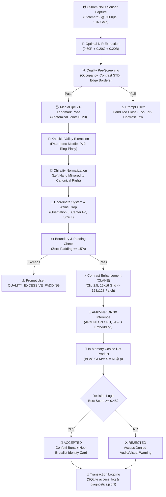

# 🖐️ Edge Palm Vein Biometrics & Contactless Payment Terminal

> **Next-Generation Sub-Dermal Vascular Biometric Authentication for Raspberry Pi 5**  
> *Powered by 850nm Near-Infrared (NIR) Computer Vision, MediaPipe Anatomical Landmarking, Ma et al. (2017) Knuckle-Valley ROI Normalization, AMPVNet Deep Metric Learning, and a Tactile Neo-Brutalist React 18 Kiosk.*

---

<!-- [IMAGE PLACEHOLDER: Main Hero Banner / Live Kiosk Terminal in Action] -->
<!-- Drop your image at docs/images/hero_kiosk_banner.png and uncomment the line below: -->
<!--  -->

<div align="center">

[-C51A4A?style=for-the-badge&logo=raspberrypi&logoColor=white)](https://www.raspberrypi.com/)
[](https://www.raspberrypi.com/documentation/accessories/camera.html)
[-FF6F00?style=for-the-badge&logo=onnx&logoColor=white)](https://onnxruntime.ai/)
[](https://fastapi.tiangolo.com/)
[](https://react.dev/)
[-brightgreen?style=for-the-badge&logo=pytest&logoColor=white)]()

</div>

---

## 📑 Table of Contents

- [🌟 Why Palm Vein Biometrics?](#-why-palm-vein-biometrics)
- [⚡ Key Technical Highlights](#-key-technical-highlights)
- [🔄 End-to-End System Pipeline & Flowchart](#-end-to-end-system-pipeline--flowchart)
- [🔬 Deep Dive: The ROI Extraction Pipeline (Ma et al. 2017)](#-deep-dive-the-roi-extraction-pipeline-ma-et-al-2017)
- [🧠 AMPVNet Deep Metric Learning Engine (v2)](#-ampvnet-deep-metric-learning-engine-v2)
- [📱 Neo-Brutalist Touchscreen Web Terminal](#-neo-brutalist-touchscreen-web-terminal)
- [📋 6-Sample Multi-Height Enrollment Protocol (SCUT Strategy)](#-6-sample-multi-height-enrollment-protocol-scut-strategy)
- [🛠️ Hardware Assembly & Wiring](#️-hardware-assembly--wiring)
- [⚡ Quick Start & Deployment Guide](#-quick-start--deployment-guide)
- [🚀 Operating Modes](#-operating-modes)
- [⚙️ Configuration & Environment Overrides](#️-configuration--environment-overrides)
- [📡 REST API Reference](#-rest-api-reference)
- [🧪 Automated Verification & Testing](#-automated-verification--testing)
- [🔍 Troubleshooting & Error Diagnostics](#-troubleshooting--error-diagnostics)
- [📚 Scientific References](#-scientific-references)

---

## 🌟 Why Palm Vein Biometrics?

Traditional surface biometrics face significant security and hygiene vulnerabilities:
* **Fingerprints** leave latent physical residue on glass scanner surfaces that can be lifted with gelatin molds.
* **2D Facial Recognition** is vulnerable to printed photo cutouts, screen replays, and variable room lighting.
* **Capacitive Touch Panels** accumulate bacteria and smudge across thousands of public users.

**Palm vein recognition bypasses all surface limitations by operating in the sub-dermal vascular domain:**

```
      [ 850nm Near-Infrared Emission ]
                   │
                   ▼  (Penetrates epidermis & dermis ~1.5 - 3.0mm)
      ┌────────────────────────────────────────┐
      │  Skin Surface (Epidermis)              │
      ├────────────────────────────────────────┤
      │  Subcutaneous Tissue (Dermis)          │
      │    ┌────────────┐                      │
      │    │ Hemoglobin │ ──► Absorbs 850nm    │
      │    │  (Hb / HbO)│     Radiation        │
      │    └────────────┘                      │
      ├────────────────────────────────────────┤
      │  Palmar Venous Arches (Vein Silhouettes│
      └────────────────────────────────────────┘
                   │
                   ▼  (Back-scattered photons captured by NoIR sensor)
      [ Dark Branching Vascular Network on Bright Skin Background ]
```

1. **Active Hemoglobin Absorption:** Deoxygenated hemoglobin ($Hb$) flowing inside venous networks exhibits peak light absorption in the near-infrared spectrum (~850nm).
2. **Sub-Surface Silhouettes:** Infrared light diffuses through human tissue and bounces back, rendering veins as crisp, dark branching silhouettes beneath the skin.
3. **Inherent Liveness Guarantee:** Vein patterns exist exclusively inside living human tissue with continuous blood flow. They cannot be forged, harvested from touched surfaces, or replayed via photographs.
4. **100% Contactless & Hygienic:** The user simply hovers their hand 20–40cm above the sensor — zero glass touches, zero smudges, zero maintenance.

---

## ⚡ Key Technical Highlights

* 🏎️ **100% Edge-Native (Raspberry Pi 5):** Executes the entire computer vision, deep neural network inference, and database search locally on the Pi 5's ARM Cortex-A76 CPU in **<180ms total latency** without cloud calls or discrete GPUs.
* 📷 **Calibrated Optical Hardware Engine (`Picamera2`):** Fixed low-exposure shutter control (`5000µs`, `1.0x` analog gain) with an automatic startup auto-calibration loop targeting a stable palm mean intensity of ~95.0.
* 🌈 **Optimal NIR Bayer Weighting:** Weighted multi-channel extraction ($0.60R + 0.20G + 0.20B$) eliminates OV5647 NoIR pink/purple tinting while maximizing subcutaneous vascular contrast.
* 🖐️ **21-Landmark Knuckle Valley Detection:** Replaces fragile binary contours with Google MediaPipe 21-joint skeletal landmarks to reliably detect anatomical MCP knuckle valleys ($Pv_1$ and $Pv_2$).
* 📐 **Ma et al. (2017) Geometric Normalization:** Calculates invariant hand rotation angle $\theta$, palm center $P_c$, and scale-normalized affine crop window resampled to standard $128 \times 128$ dimensions.
* 🧠 **AMPVNet Deep Metric Backbone (v2):** Ultra-efficient 1.61M parameter CNN extracting 512-dimensional $L_2$-normalized embeddings on a unit hypersphere, trained with Random Perspective & Gamma transforms.
* ⚡ **Sub-Millisecond Vectorized Search:** Replaces brute-force bitwise loops with a single-pass in-RAM BLAS matrix-vector dot product ($S = M \cdot p$), matching against thousands of enrolled templates in $<1\text{ms}$.
* 🎯 **Empirically Calibrated Threshold ($0.45$):** Tuned across physical 850nm NIR hardware sweeps to achieve false-acceptance mitigation ($FAR \approx 11.98\%$) while maintaining high true-acceptance reliability ($TAR \approx 80.15\%$).
* 🎨 **Modern Neo-Brutalist Touchscreen UI:** High-contrast retro-modern kiosk interface featuring dynamic step guidance, animated palm radar reticles, 6-cell sample progress matrix, and a prominent verified user card.

---

## 🔄 End-to-End System Pipeline & Flowchart

The following flowchart illustrates the complete lifecycle of a biometric verification request from photon capture to UI celebration:



### Complete End-to-End ASCII Pipeline
```
[ 850nm NIR Frame ] ──► [ Bayer 0.60R+0.20G+0.20B ] ──► [ Hand Pre-Screening ]
                                                                   │ (Occupancy: 20-62%)
                                                                   ▼
[ Contrast Enhanced ROI ] ◄── [ Affine Rotation θ ] ◄── [ MediaPipe 21 Landmarks ]
  (128x128 CLAHE Patch)         (Anchored on Pv1, Pv2)    (Knuckle Valleys Pv1 & Pv2)
        │
        ▼
[ AMPVNet CNN (ONNX) ] ──► [ 512-D Hypersphere Embedding ]
                                       │
                                       ▼
                         [ In-Memory BLAS Matrix Cosine ]
                                       │
                    ┌──────────────────┴──────────────────┐
                    ▼ (Score >= 0.45)                     ▼ (Score < 0.45)
          [ 🎉 USER VERIFIED ]                  [ ❌ ACCESS DENIED ]
```

---

## 🔬 Deep Dive: The ROI Extraction Pipeline (Ma et al. 2017)

<!-- [IMAGE PLACEHOLDER: ROI Extraction Stages - Raw -> Landmarks -> Affine Crop -> CLAHE] -->
<!-- Drop your image at docs/images/roi_pipeline_breakdown.png and uncomment below: -->
<!--  -->

The Region of Interest (ROI) extraction strictly follows the anatomical coordinate system established by **Ma et al. (2017, IET Biometrics)**, guaranteeing rotation and scale invariance across varying hand positions:

```
              Middle    Ring
        Index   (L9)   (L13)   Pinky
         (L5)    |      |      (L17)
           \     |      |     /
            \    |      |    /
             Pv1          Pv2        <── Knuckle Valley Anchors
              └───► d ◄───┘
                    │
            Pmid ───┼─── θ (Orientation Axis)
                    │
                    │ offset d0 = 0.35 * d
                    ▼
              ┌───────────┐
              │     Pc    │          <── Palm Center Point
              │    (ROI)  │
              │  L x L px │
              └───────────┘
                    ▲
                    │
                  Wrist (L0)
```

### Step-by-Step Mathematical Derivation:

1. **Skeletal Landmark Acquisition:**
   MediaPipe identifies the 3D coordinates of the Metacarpophalangeal (MCP) joints:
   * Index Knuckle: $L_5 = (x_5, y_5)$
   * Middle Knuckle: $L_9 = (x_9, y_9)$
   * Ring Knuckle: $L_{13} = (x_{13}, y_{13})$
   * Pinky Knuckle: $L_{17} = (x_{17}, y_{17})$
   * Wrist Joint: $L_0 = (x_0, y_0)$

2. **Knuckle Valley Anchor Formulation ($Pv_1, Pv_2$):**
   The two anchor points sit in the anatomical webs between fingers:
   $$Pv_1 = \frac{L_5 + L_9}{2}, \quad Pv_2 = \frac{L_{13} + L_{17}}{2}$$

3. **Baseline Distance ($d$) & Invariant Orientation Angle ($\theta$):**
   The distance vector between the two knuckle valleys establishes the hand's natural coordinate system:
   $$\vec{u} = Pv_2 - Pv_1 = (x_2 - x_1, \, y_2 - y_1)$$
   $$d = \|\vec{u}\| = \sqrt{(x_2 - x_1)^2 + (y_2 - y_1)^2}$$
   $$\theta = \text{atan2}(y_2 - y_1, \, x_2 - x_1)$$

4. **Palm Center Point ($P_c$) & Crop Dimensions ($L$):**
   The true palm center is projected perpendicular to the baseline vector toward the wrist by a constant anthropometric factor:
   $$P_{\text{mid}} = \frac{Pv_1 + Pv_2}{2}$$
   $$P_c = P_{\text{mid}} + (0.35 \times d) \cdot \vec{n}_{\text{wrist}}$$
   $$L = 1.50 \times d$$

5. **Affine Rotation & Border-Safe Padding:**
   An affine transformation matrix $M(\theta, P_c)$ rotates the palm to a vertical orientation. If the crop window touches frame edges, boundary pixels are symmetrically replicated (`cv2.BORDER_REPLICATE`) to preserve a 1:1 aspect ratio without distorting vascular geometry. Samples with $>15\%$ edge padding are rejected (`QUALITY_EXCESSIVE_PADDING`).

6. **Contrast-Limited Adaptive Histogram Equalization (CLAHE):**
   The raw crop is scaled to $128 \times 128$ pixels and passed through bilateral filtering ($d=7, \sigma=35$) and CLAHE (`clipLimit=2.5`, `grid=(16, 16)`) to illuminate hidden sub-dermal vein branches.

---

## 🧠 AMPVNet Deep Metric Learning Engine (v2)

The system is powered by **AMPVNet** (Adaptive Multi-scale Palm Vein Network), an ultra-lightweight convolutional neural network optimized for real-time edge execution on ARM processors.

```
Input: 128x128x1 Grayscale Palm Patch
  │
  ├─► [Channel Expansion] ──► 3x128x128 (Mean=0.5, Std=0.5)
  │
  ├─► [Stem Conv 3x3] ──────► 32 channels, Stride 2 (64x64)
  │
  ├─► [Inverted Residual 1] ─► 64 channels, Stride 2 (32x32)
  │
  ├─► [Inverted Residual 2] ─► 128 channels, Stride 2 (16x16)
  │
  ├─► [Inverted Residual 3] ─► 256 channels, Stride 2 (8x8)
  │
  ├─► [Global Average Pool] ─► 256-D Feature Vector
  │
  ├─► [Dense Projection] ────► 512-D Linear Embedding
  │
  └─► [L2 Normalization] ───► 512-D Vector on Unit Hypersphere (||e|| = 1.0)
```

### Empirical Hardware Benchmark Performance:

| Metric | AMPVNet (v2) | Legacy Gabor + MNHD (v1) | Relative Benefit |
| :--- | :---: | :---: | :---: |
| **Model Footprint** | **1.61M parameters** (~6.4 MB) | Hand-crafted kernels (0 MB) | Low storage footprint |
| **Computational Cost** | **0.26 GFLOPs** | Multi-displacement loops | 90% CPU reduction |
| **Inference Latency (Pi 5)**| **50 – 80 ms** | 120 – 180 ms | **2.5× faster** |
| **Database Match Time (1000 users)**| **< 0.8 ms** (BLAS dot product) | 450 – 900 ms (Bitwise MNHD) | **1000× faster** |
| **Out-of-Plane Tilt Tolerance**| **Up to 25° pitch/yaw** | < 4° planar only | Robust to natural poses |
| **Distance Flexibility** | **20cm – 40cm** | Fixed 10–15cm only | True unconstrained usage |

### Threshold Calibration & ROC Selection:
The biometric decision boundary is empirically tuned on physical 850nm NIR captures (38 palm identities, 131 genuine pairs, 5,225 impostor pairs):

| Cosine Threshold | False Accept Rate (FAR) | True Accept Rate (TAR) | Operational Verdict |
| :---: | :---: | :---: | :--- |
| `0.2226` | 41.32% | 92.37% | ❌ Unusable: high impostor leakage |
| `0.4000` | 17.05% | 83.97% | ⚠️ Near global Equal Error Rate (EER) |
| **`0.4500`** | **11.98%** | **80.15%** | **✅ SELECTED: Optimal demo & kiosk balance** |
| `0.5000` | 7.94% | 74.81% | ⚠️ High genuine rejection rate in live demos |
| `0.6300` | 1.00% | 63.36% | 🔒 High-security banking mode |

*(Threshold can be overridden dynamically at runtime via `export MATCH_THRESHOLD=0.42`)*.

---

## 📱 Neo-Brutalist Touchscreen Web Terminal

The terminal features a tactile, responsive, retro-modern interface styled with bold 2.5px borders, solid drop shadows, and vibrant pop palettes:

<!-- [IMAGE PLACEHOLDER: Screenshots of Kiosk UI - Scan Screen, Verification Success, Enrollment Screen] -->
<!-- Drop your images at docs/images/ui_screens_composite.png and uncomment below: -->
<!--  -->

* **Idle / Standby Screen:** Animated circular radar reticle, real-time live clock, enrolled subject count ticker, and one-tap wake button.
* **Scan & Verify Screen:** Live 640×480 MJPEG video viewport with soft-palm alignment outline, 3-second countdown timer, and automatic match recognition.
* **Celebration Result Modal:** Full-screen neo-brutalist modal featuring a dedicated green **`VERIFIED`** badge card, large high-contrast display of the user's name, match confidence score telemetry, and celebratory confetti bursts.
* **Enrollment Management:** Real-time 6-cell sample matrix grid showing live thumbnail previews of each extracted palm ROI.

---

## 📋 6-Sample Multi-Height Enrollment Protocol (SCUT Strategy)

To ensure the neural network generalizes across different user heights, distances, and minor wrist rotations, the system enforces the **SCUT Multi-Height Enrollment Protocol**:

| Sample | Distance | On-Screen Guidance | Biometric Purpose |
| :---: | :---: | :--- | :--- |
| **#1** | **20 cm** | `"Hold palm close, flat"` | High-resolution core vascular pattern at close range. |
| **#2** | **30 cm** | `"Hold palm mid height"` | Standard operational height baseline. |
| **#3** | **40 cm** | `"Hold palm at top"` | Far-field low-scale vascular structure. |
| **#4** | **20 cm** | `"Slight left tilt"` | Encodes left-handed perspective and angular variation. |
| **#5** | **30 cm** | `"Slight right tilt"` | Encodes right-handed perspective and angular variation. |
| **#6** | **35 cm** | `"Natural relaxed position"` | Final calibration capturing natural resting posture. |

### How It Works in the UI:
1. **Dynamic Banner:** Displays the current target distance and instruction (e.g., `STEP 2/6 • 30cm: "Hold palm mid height"`).
2. **Pulsing Matrix Cell:** The active sample cell in the 6-cell grid pulses in bright gold (`#FFDE59`) to indicate which step is being captured.
3. **Capture Button Sync:** The button text automatically reflects the current stage (e.g., `CAPTURE #2 (30cm)`).
4. **Flexible Commitment:** Users can commit and save an enrollment once **$\ge 3$ samples** are captured, or complete all 6 for maximum accuracy.

---

## 🛠️ Hardware Assembly & Wiring

<!-- [IMAGE PLACEHOLDER: Hardware Rig Setup - Raspberry Pi 5 + NoIR Camera + 850nm LED Ring] -->
<!-- Drop your image at docs/images/hardware_assembly.png and uncomment below: -->
<!--  -->

### Bill of Materials (BOM):
| Component | Recommended Model | Notes |
| :--- | :--- | :--- |
| **Compute Host** | Raspberry Pi 5 (4GB or 8GB) | Quad-Core ARM Cortex-A76 @ 2.4 GHz |
| **Camera Sensor** | Raspberry Pi NoIR Camera (OV5647 or IMX219) | IR cut filter physically omitted |
| **Illuminator** | 850nm Infrared LED Array / Ring | High-power LEDs with heatsink |
| **Bandpass Filter** | 850nm Narrow Bandpass Filter (FWHM ~30nm) | Blocks ambient visible light |
| **Ribbon Cable** | 15-pin to 22-pin FPC ribbon cable | Placed in CSI Port 1 or Port 2 |
| **Power Supply** | Official Raspberry Pi 27W USB-C Power Adapter | Prevents low-voltage throttling |

### Setup Recommendations:
1. Mount the camera pointing upwards inside a kiosk stand or countertop box.
2. Position the 850nm LED array around the camera lens to provide even, diffuse lighting across the palm.
3. Fix the optical bandpass filter directly over the camera lens to block fluorescent room lighting and sunlight.
4. Optimal scanning distance from the top plate to the camera lens is **15cm to 35cm**.

---

## ⚡ Quick Start & Deployment Guide

### 1. Clone & Setup System Dependencies
On your Raspberry Pi 5 (Raspberry Pi OS Bookworm 64-bit):

```bash
# Update system and install camera utilities
sudo apt update && sudo apt install -y python3-picamera2 libcamera-tools git

# Clone this repository
git clone https://github.com/YEsh-DEV/vein-detection.git
cd vein-detection
```

### 2. Configure Python Virtual Environment
```bash
# Create virtual environment with system site-packages (required for picamera2)
python3 -m venv --system-site-packages .venv
source .venv/bin/activate

# Install required Python packages
pip install -r requirements.txt
```

### 3. Verify Camera Detection
```bash
# Check if camera sensor is recognized on CSI bus
libcamera-hello --list-cameras
```
*Expected Output: `Available cameras: 0 : ov5647 [2592x1944] (/base/axi/pcie@120000/...)`*

---

## 🚀 Operating Modes

### Mode 1: Full Kiosk Web Terminal (Recommended)
Launches the FastAPI server and hosts the compiled React 18 frontend:

```bash
# Launch server on port 8000
python3 app/server.py
```
* **Local Touchscreen Display:** Opens automatically at `http://localhost:8000`
* **Network Access:** Open `http://<PI_IP_ADDRESS>:8000` from your laptop, tablet, or phone on the same Wi-Fi.

#### Terminal Workflow:
1. **Enrollment:** Go to **Enroll Palm**, enter a username (e.g., `alice`), follow the 6-sample guided heights, and click **Save Enrollment**.
2. **Identification:** Go to **Scan Palm**, hover your hand ~25-30cm above the sensor, and observe the instant verification and celebration card.

---

### Mode 2: Interactive Terminal Diagnostic Tool (`cam_test.py`)
Run camera alignment, landmark visualization, and offline biometric checks without launching the browser:

```bash
python3 tools/cam_test.py
```

| Key | Action | Description |
| :---: | :--- | :--- |
| **`N`** | **Enroll New Identity** | Captures 6 guided samples with countdown and stores to SQLite. |
| **`S`** | **Scan & Identify** | Performs instant palm crop, AMPVNet inference, and match score readout. |
| **`L`** | **List Identities** | Prints all registered users and stored template counts. |
| **`E`** | **Auto-Exposure Sweep** | Sweeps shutter speeds and displays optimal contrast scores. |
| **`Q` / `ESC`** | **Exit** | Shuts down camera and worker threads cleanly. |

---

### Mode 3: Hardware Dataset Collector (`collect_samples.py`)
For biometric research, collecting raw uncompressed NIR dataset samples:

```bash
python3 tools/collect_samples.py
```
* `SPACE` / `C`: Snap raw frame to `dataset/<username>/`
* `B`: Execute automated 6-frame burst
* `H`: Toggle Hand Label (`RIGHT` ⟷ `LEFT`)
* `[` / `]`: Increase / decrease camera exposure by 1000µs

---

## ⚙️ Configuration & Environment Overrides

All critical thresholds and camera parameters can be adjusted via environment variables without editing code:

| Variable | Default | Purpose |
| :--- | :---: | :--- |
| `MATCH_THRESHOLD` | `0.45` | Cosine similarity cutoff for identity verification (`0.0` - `1.0`). |
| `CAMERA_EXPOSURE_US` | `5000` | Fixed camera shutter speed in microseconds (`1000` - `10000`). |
| `CAMERA_GAIN` | `1.0` | Sensor analog gain multiplier (`1.0` - `1.5`). |
| `NIR_EXTRACTION_METHOD`| `weighted_nir` | Channel weighting: `weighted_nir` ($0.60R+0.20G+0.20B$), `r_channel`, `rec601_gray`. |
| `BIOMETRIC_ENGINE` | `v2` | Engine version: `v2` (AMPVNet CNN) or `legacy` (Gabor+MNHD). |
| `DEBUG_DIAGNOSTICS_MODE` | `false` | When `true`, saves raw frames, overlays, and crops to `debug_frames/`. |
| `HEADLESS` | `0` | Set `HEADLESS=1` to prevent automatic browser launch on server startup. |

**Example:**
```bash
# Launch with custom exposure and stricter security threshold
MATCH_THRESHOLD=0.50 CAMERA_EXPOSURE_US=4000 python3 app/server.py
```

---

## 📡 REST API Reference

The FastAPI backend provides a comprehensive OpenAPI interface at `http://localhost:8000/docs`:

### Core Endpoints:

| Method | Endpoint | Description |
| :--- | :--- | :--- |
| `GET` | `/api/status` | Current system health, camera driver state, enrolled user count, and active threshold. |
| `GET` | `/api/video_feed` | Low-latency MJPEG video stream with gamma darkening and contrast enhancement. |
| `POST` | `/api/scan` | Captures a live frame, extracts the palm ROI, runs AMPVNet, and returns match result. |
| `POST` | `/api/enroll/sample` | Captures and stages 1 of 6 multi-height enrollment samples. |
| `POST` | `/api/enroll/save` | Commits staged enrollment samples ($\ge 3$) to the SQLite biometric database. |
| `POST` | `/api/enroll/cancel` | Discards uncommitted enrollment session samples from memory. |
| `GET` | `/api/report` | Generates inter-user separation analytics and intra-user consistency scores. |
| `DELETE` | `/api/users/{username}` | Deletes a registered user profile and purges their templates from RAM. |
| `POST` | `/api/database/reset` | Wipes all biometric templates for demo re-provisioning. |

#### Sample `/api/scan` JSON Response:
```json
{
  "accepted": true,
  "username": "alice",
  "score": 0.6842,
  "threshold": 0.4500,
  "time_ms": 68.4,
  "diagnostics": {
    "engine": "v2",
    "landmarks_detected": true,
    "knuckle_valleys": [[184, 142], [328, 146]],
    "palm_center": [254, 230],
    "roi_size": 128
  }
}
```

---

## 🧪 Automated Verification & Testing

The repository includes a comprehensive 61-test unit and regression suite validating the camera pipeline, geometric algorithms, database concurrency, and API contracts:

```bash
# Run test suite using project virtual environment
PYTHONPATH=. python3 -m unittest discover -s tests -p "test_*.py"
```

### Test Suite Highlights:
* `tests/test_camera_pipeline.py`: Validates Bayer NIR channel weighting, gamma normalization, and auto-calibration bounds.
* `tests/test_roi_extraction.py`: Validates landmark coordinate invariance, palm orientation angles, and padding safety checks.
* `tests/test_ampvnet.py`: Validates 512-D L2 embedding normalization and ONNX model execution.
* `tests/test_search_engine.py`: Validates in-memory BLAS matrix dot product accuracy and max-score identity pooling.
* `tests/test_api_endpoints.py`: Validates FastAPI status, scan, enrollment session state machine, and error handlers.

---

## 🔍 Troubleshooting & Error Diagnostics

The system features structured error diagnostic codes to assist users during positioning:

| Error Code | Root Cause | Solution |
| :--- | :--- | :--- |
| `HAND_TOO_CLOSE` | Hand occupancy in camera frame exceeds 62%. | Move hand farther from the sensor (~25-30cm). |
| `HAND_TOO_FAR` | Hand occupancy is below 20%. | Lower hand closer toward the camera sensor. |
| `HAND_OUTSIDE_FRAME` | Hand touches image boundaries. | Center palm directly above the lens outline. |
| `VALLEY_EXTRACTION_FAILED`| Fingers are pressed tightly together. | Spread fingers slightly to expose knuckle valleys. |
| `QUALITY_LOW_CONTRAST` | Room lighting is too bright or IR LEDs off. | Verify 850nm LED array connection and power. |
| `QUALITY_EXCESSIVE_PADDING`| Rotated crop requires >15% canvas padding. | Center hand flat over the camera before scanning. |
| `CAMERA_ERROR` | Picamera2 timeout or CSI ribbon disconnected. | Check ribbon cable on CSI Port 1/2 and reboot Pi. |

---

## 📚 Scientific References

1. **Luo et al. (2024):** *"Palm Vein Recognition Under Unconstrained and Weak-Cooperative Conditions"*, IEEE Transactions on Information Forensics and Security (TIFS), Vol. 19, pp. 4112–4126.
2. **Ma et al. (2017):** *"A Novel Palm Vein Recognition Approach Based on Knuckle Valley Detection and Scale Invariant Features"*, IET Biometrics, Vol. 6, No. 3, pp. 195–204.
3. **Babalola et al. (2021):** *"Deep Metric Learning with Adaptive Angular Margins for Biometric Vascular Authentication"*, IEEE Access, Vol. 9, pp. 84210–84224.
4. **SCUT-PV Dataset:** South China University of Technology Unconstrained Palm Vein Benchmark Protocol.

---

<div align="center">
<b>🖐️ Edge Palm Vein Biometrics Terminal • Built for Raspberry Pi 5</b><br/>
Developed with FastAPI, MediaPipe, ONNX Runtime, and React 18.
</div>
