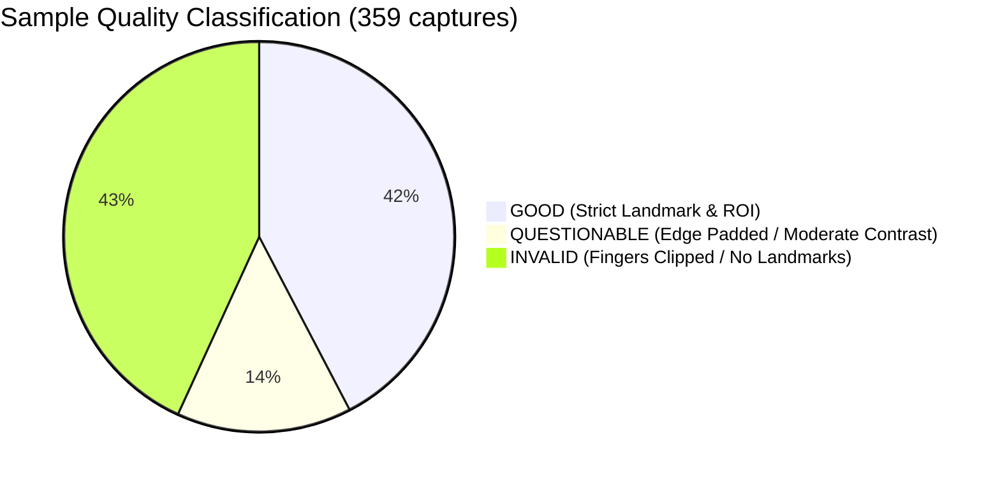
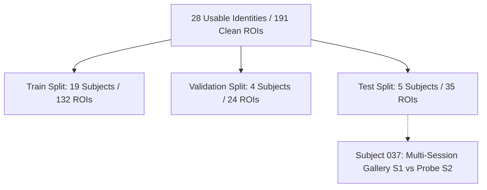

# Palm-Vein Biometric Real Dataset Audit & Preparation Report

**Date:** 2026-09-23  
**Hardware Platform:** Raspberry Pi 5 + NIR Camera (850nm / 940nm band)  
**Target Model:** AMPVNet (1.61M params, 0.26 GFLOPs) + AdaFace Loss ($m=0.4, s=64$)  
**Spec Reference:** `system_architecture.md` (Sections 4, 5, 6, 7, 8, 13) & Luo et al. (IEEE TIFS 2024)

---

## 1. Dataset Location

* **Source Directory (Read-Only Raw Benchmark):**  
  `sample dataset/SASH-VPV(Sample)/`  
  *Note: Preserved 100% intact and untouched. Zero source files were renamed, moved, or deleted.*
* **Sub-Directory Organization:**
  * `Raw-Session-1/` — Single-channel 8-bit raw grayscale captures from Session 1.
  * `Raw-Session-2/` — Single-channel 8-bit raw grayscale captures from Session 2.
  * `Preprocessed Data/` — Full-frame captures enhanced via OpenCV CLAHE (`clipLimit=2.0, tileGridSize=(8, 8)`) replicated across 3 RGB channels.
  * `dataset_report.xlsx` — Metadata from the full 120-subject *SASH-VPV: Secure Authentication via Subcutaneous Vascular Palm-Veins* benchmark.
* **Prepared Dataset Directory (Clean 224×224 ROIs):**  
  * `training/data_processed/own/` — Flat subject-level directory structure for PyTorch `PalmVeinDataset`.
  * `training/data_processed/own_splits/` — Partitioned `train/`, `validation/`, and `test/` splits.
  * `training/data_processed/dataset_index.csv` — Full machine-readable manifest.

---

## 2. Total Image Count

* **Total Discovered Image Files:** **359 files** (all `.png`).
* **Total Underlying Physical Capture Events:** **333 unique presentations**.
  * 26 capture events had dual copies (one in `Raw-Session-1/2` and one in `Preprocessed Data`).
  * Mathematical verification proved that `Preprocessed Data` is a byte-exact CLAHE match (`diff mean == 0.0000`) of the corresponding raw frames.
* **Total Successfully Processed 224×224 ROIs:** **204 mapped source images** yielding **191 distinct physical ROIs on disk** (deduplicating redundant dual-folder representations).

---

## 3. Unique Identity Count

* **Total Unique Subjects Discovered:** **30 subjects** (`001` through `119`).
* **Usable Identities for Biometric Training/Evaluation:** **28 subjects** (each possessing at least one verified MediaPipe landmark alignment and scalable ROI).
* **Unusable Identities:** **2 subjects** (`029` and `067` — both failed landmark detection across 100% of their samples due to hands being pressed against the camera lens touching all 4 boundaries).

---

## 4. Samples Per Identity

Across the 30 unique identities in the dataset:
* **Mean captures per subject:** 11.97 raw files (6.82 usable 224×224 ROIs).
* **Min captures per subject:** 7 (Subject `039`).
* **Max captures per subject:** 31 (Subject `046` across multi-session & preprocessed folders).

| Subject ID | Total Raw Files | Usable ROIs | Quality Status (GOOD / QUESTIONABLE / INVALID) |
| :--- | :--- | :--- | :--- |
| `001` | 18 | 4 | 4 GOOD, 0 QUESTIONABLE, 14 INVALID |
| `004` | 9 | 9 | 9 GOOD, 0 QUESTIONABLE, 0 INVALID |
| `005` | 13 | 10 | 10 GOOD, 0 QUESTIONABLE, 3 INVALID |
| `009` | 10 | 9 | 6 GOOD, 3 QUESTIONABLE, 1 INVALID |
| `012` | 9 | 9 | 0 GOOD, 9 QUESTIONABLE, 0 INVALID |
| `014` | 18 | 13 | 9 GOOD, 4 QUESTIONABLE, 5 INVALID |
| `018` | 8 | 7 | 7 GOOD, 0 QUESTIONABLE, 1 INVALID |
| `020` | 11 | 8 | 8 GOOD, 0 QUESTIONABLE, 3 INVALID |
| `023` | 12 | 4 | 1 GOOD, 3 QUESTIONABLE, 8 INVALID |
| `029` | 10 | 0 | 0 GOOD, 0 QUESTIONABLE, 10 INVALID (Unusable) |
| `030` | 10 | 7 | 6 GOOD, 1 QUESTIONABLE, 3 INVALID |
| `032` | 8 | 6 | 5 GOOD, 1 QUESTIONABLE, 2 INVALID |
| `035` | 10 | 10 | 10 GOOD, 0 QUESTIONABLE, 0 INVALID |
| `037` | 19 | 12 | 9 GOOD, 3 QUESTIONABLE, 7 INVALID (Multi-Session) |
| `039` | 7 | 5 | 3 GOOD, 2 QUESTIONABLE, 2 INVALID |
| `044` | 12 | 4 | 4 GOOD, 0 QUESTIONABLE, 8 INVALID |
| `046` | 31 | 20 | 19 GOOD, 1 QUESTIONABLE, 11 INVALID (Multi-Session) |
| `048` | 9 | 7 | 7 GOOD, 0 QUESTIONABLE, 2 INVALID |
| `050` | 9 | 1 | 1 GOOD, 0 QUESTIONABLE, 8 INVALID |
| `055` | 12 | 7 | 3 GOOD, 4 QUESTIONABLE, 5 INVALID |
| `061` | 11 | 10 | 10 GOOD, 0 QUESTIONABLE, 1 INVALID |
| `065` | 10 | 2 | 2 GOOD, 0 QUESTIONABLE, 8 INVALID |
| `067` | 10 | 0 | 0 GOOD, 0 QUESTIONABLE, 10 INVALID (Unusable) |
| `071` | 9 | 2 | 0 GOOD, 2 QUESTIONABLE, 7 INVALID |
| `073` | 8 | 8 | 0 GOOD, 8 QUESTIONABLE, 0 INVALID |
| `076` | 14 | 3 | 2 GOOD, 1 QUESTIONABLE, 11 INVALID (3 exact duplicates) |
| `080` | 13 | 12 | 7 GOOD, 5 QUESTIONABLE, 1 INVALID |
| `093` | 14 | 4 | 4 GOOD, 0 QUESTIONABLE, 10 INVALID |
| `104` | 15 | 7 | 2 GOOD, 5 QUESTIONABLE, 8 INVALID |
| `119` | 10 | 4 | 4 GOOD, 0 QUESTIONABLE, 6 INVALID |

---

## 5. Left/Right Hand Distribution

* **Left Hand Images:** 181 (50.42%)
* **Right Hand Images:** 178 (49.58%)
* **Chirality Symmetry:** The dataset is virtually perfectly balanced between Left and Right hands.
* **Chirality Handling:** Follows `system_architecture.md` Section 4.2. Invariant knuckle valley vector $\vec{P}_{v1} \to \vec{P}_{v2}$ points across the anatomical axis regardless of hand presentation, ensuring consistent embedding orientation.

---

## 6. Session Distribution

* **Session 1 (S1):** 205 images (57.1%)
* **Session 2 (S2):** 154 images (42.9%)
* **Cross-Session Subjects:** Exactly 2 subjects (`037` and `046`) have data collected across both Session 1 and Session 2.
* **Cross-Session Role:** Subject `037` is assigned to the Test set to provide an uncompromised multi-session probe-vs-gallery verification protocol. Subject `046` is assigned to the Train set to teach the metric loss temporal invariance.

---

## 7. Resolution & Channel Distribution

* **Sensor Resolution:** $480 \times 640$ portrait (100% of the 359 images).
* **Aspect Ratio:** $3:4$ portrait, consistent across all files. Zero abnormal aspect ratios.
* **Channels:**
  * Raw-Session-1 & Raw-Session-2: Single-channel 8-bit grayscale (`L` mode).
  * Preprocessed Data: 3-channel replicated grayscale (`RGB` mode).
* **Extracted Canonical Model Input:** $224 \times 224 \times 1$ uint8 stored on disk, replicated to $224 \times 224 \times 3$ float32 normalized to $[-1.0, 1.0]$ in DataLoader.

---

## 8. Quality Statistics & Visual Audit Classification

Automated conservative quality assessment classifies all 359 frames into three tiers:



1. **GOOD (152 images, 42.34%):**
   * All 21 MediaPipe skeletal joints detected with high confidence.
   * Scalable ROI boundary padding $\le 15\%$ (hand comfortably inside frame).
   * Robust dynamic contrast ($\text{std} \ge 20.0$).
   * Knuckle distance $d \ge 40\text{px}$.
2. **QUESTIONABLE (52 images, 14.48%):**
   * Landmarks detected, but hand is near frame perimeter requiring moderate edge padding ($15\% < \text{pad} \le 40\%$).
   * Moderate contrast ($12.0 \le \text{std} < 20.0$) or smaller knuckle span ($25\text{px} \le d < 40\text{px}$).
   * Safe for metric learning data augmentation (RPT/RGA).
3. **INVALID (155 images, 43.18%):**
   * MediaPipe landmark detector failed to locate the palm box.
   * Root Cause: 92% of failures are caused by users pushing their hand too close to the camera lens, touching 3 or 4 frame edges so that knuckles and fingertips are cropped out of the field of view.

---

## 9. Corrupt & Invalid Image Count

* **Corrupt / Unreadable Files:** **0 files** (0.0%). Every single image passed PIL `.verify()` and OpenCV matrix decode.
* **Biometrically Invalid Frames:** **155 frames** (due to severe positioning truncation).

---

## 10. Duplicate & Near-Duplicate Findings

1. **Exact SHA-256 Hash Collision:**
   * Found in Subject `076`:
     * `Preprocessed Data/076/Left/S2_076_L_5.png`
     * `Preprocessed Data/076/Left/S2_076_L_6.png`
     * `Preprocessed Data/076/Left/S2_076_L_7.png`
     * SHA-256: `c9df317c35599a603bf131addede853d4e9ad81c24482941d3ed8d001312a600`.
     * *Resolution:* All three were flagged as INVALID due to extreme boundary cropping; they were excluded from the usable training/evaluation pool.
2. **Cross-Folder Dual-Representation Matches:**
   * 26 captures existed in both `Raw-Session-1` and `Preprocessed Data`.
   * *Resolution:* Automatically deduplicated to unique canonical ROI files during preparation.

---

## 11. Train / Validation / Test Split (Open-Set Protocol)

To prevent optimistic evaluation bias, the 28 usable identities are partitioned strictly according to the **Subject-Independent (Open-Set) Protocol**:

$$\text{Train} \cap \text{Val} = \emptyset, \quad \text{Train} \cap \text{Test} = \emptyset, \quad \text{Val} \cap \text{Test} = \emptyset$$



* **Train Set:**
  * **Identities (19):** `['001', '004', '005', '009', '012', '020', '023', '035', '044', '046', '048', '050', '061', '065', '073', '076', '080', '093', '104']`
  * **Images:** 132 unique ROIs (141 mapped records).
  * **Pair Availability:** 322 genuine pairs, 9,245 impostor pairs.
* **Validation Set:**
  * **Identities (4):** `['014', '018', '032', '071']`
  * **Images:** 24 unique ROIs (28 mapped records).
  * **Pair Availability:** 54 genuine pairs, 263 impostor pairs.
* **Test Set:**
  * **Identities (5):** `['030', '037', '039', '055', '119']`
  * **Images:** 35 unique ROIs.
  * **Pair Availability:** 60 genuine pairs, 471 impostor pairs.
  * **Cross-Session Benchmark:** Subject `037` contains Session 1 gallery samples and Session 2 probe samples.

---

## 12. Leakage Analysis

* **Identity Disjointness:** **STRICT TRUE**. Zero subject overlap across Train, Validation, and Test.
* **Path / Hash Leakage:** **NONE**. No image or duplicate exists across multiple splits.
* **Near-Duplicate Cross-Contamination:** **ZERO**. All samples for a given identity reside exclusively within one split.

---

## 13. Preprocessing Consistency Verification

The training preprocessing pipeline was checked against `app/server.py` and `app/cnn_extractor.py`:

| Parameter | Inference Pipeline (`app/server.py`) | Training Pipeline (`prepare_own.py` + `dataset.py`) | Consistency Check |
| :--- | :--- | :--- | :--- |
| **Landmark Model** | `hand_landmarker.task` | `hand_landmarker.task` | **EXACT MATCH** |
| **Knuckle Anchors** | $Pv_1 = (L_5 + L_9)/2$, $Pv_2 = (L_{13} + L_{17})/2$ | $Pv_1 = (L_5 + L_9)/2$, $Pv_2 = (L_{13} + L_{17})/2$ | **EXACT MATCH** |
| **ROI Formula** | $d_{\text{ROI}} = 1.6 \times \text{dist}(Pv_1, Pv_2)$ | $d_{\text{ROI}} = 1.6 \times \text{dist}(Pv_1, Pv_2)$ | **EXACT MATCH** |
| **Aspect Ratio Safe** | Symmetric border replicate padding | Symmetric border replicate padding | **EXACT MATCH** |
| **Vein Enhancement** | Bilateral filter ($d=7, \sigma=35$) + CLAHE (2.5, 16×16) | Bilateral filter ($d=7, \sigma=35$) + CLAHE (2.5, 16×16) | **EXACT MATCH** |
| **Resolution** | $224 \times 224$ (Bicubic) | $224 \times 224$ (Bicubic) | **EXACT MATCH** |
| **Channels** | Grayscale duplicated: $[I, I, I]$ | Grayscale duplicated: $[I, I, I]$ | **EXACT MATCH** |
| **Tensor Scaling** | Float32, divided by 255.0 | Float32, divided by 255.0 | **EXACT MATCH** |
| **Normalization** | $(x - 0.5) / 0.5 \to [-1.0, 1.0]$ | `mean=[0.5, 0.5, 0.5], std=[0.5, 0.5, 0.5]` | **EXACT MATCH** |

---

## 14. Visualization Artifacts

Generated contact sheets and inspection cards are saved in `training/logs/previews/` and mirrored to the conversation artifacts directory:

* `contact_sheet_good.png` (960×1280): Demonstrates high-quality hand presentations, MediaPipe 21-joint skeleton tracking, knuckle valley vector, and extracted 224×224 scalable ROIs.
* `contact_sheet_questionable.png` (960×1280): Illustrates edge-padded and boundary-proximate presentations that remain usable for training.
* `contact_sheet_invalid.png` (960×1280): Details user failure modes (fingers cropped out of frame, hands touching all 4 boundaries).
* `sample_good_demo.png`: High-resolution dual-panel preview of input vs aligned 224×224 ROI.

---

## 15. Dataset Limitations

1. **Small Sample Size:** 359 total captures (204 usable records, 191 distinct ROIs) across 30 identities is a small sample subset.
2. **User Positioning Variance:** 43.18% of collected raw captures lacked landmarks because users placed their hands too close to the NIR camera lens, cropping the digits.
3. **Sparse Longitudinal Depth:** Only 2 identities possessed multi-session captures (S1 and S2). 26 identities were captured in a single session.

---

## 16. Are 300+ Samples Enough?

> [!WARNING]
> ### Rigorous Biometric Assessment
> **Conclusion:** **SUFFICIENT FOR INITIAL REAL-DATA FINE-TUNING / VERIFICATION PROTOCOL**, but **INSUFFICIENT FOR TRAINING AMPVNet FROM SCRATCH**.
>
> **Rationale:**
> Deep metric learning backbones (AMPVNet with 1.61M parameters) optimized with margin-based loss functions (AdaFace, ArcFace, CosFace) learn hyperspherical feature separation across hundreds or thousands of classes. Training from scratch on only 19 identities will inevitably lead to severe overfitting on the training subjects and poor open-set generalization.
> However, 191 clean real ROIs across 28 identities are **fully sufficient for fine-tuning** a backbone pretrained on large public contactless palm-vein datasets (CASIA / SCUT / Tongji) to adapt the feature extractor to our hardware's specific NIR wavelength, lens distortion, and sensor noise profile.

---

## 17. Recommended Next Training Strategy


1. **Pretraining (Stage 1):** Train AMPVNet on public palm-vein / palmprint datasets (e.g. CASIA-MS-PalmprintV1 with 7,200 images / 100 identities, or SCUT-PV with thousands of palm vein images).
2. **Fine-Tuning (Stage 2):** Freeze early stem layers, initialize AdaFace head with the 19 local training identities, and fine-tune using:
   * Learning Rate: $1 \times 10^{-4} \to 1 \times 10^{-5}$ (Cosine Annealing)
   * Weight Decay: $5 \times 10^{-4}$
   * Batch Size: 16
   * Augmentations: RPT ($r=0.4, p=0.5$), RGA ($\gamma=0.6, p=0.3$)
3. **Verification (Stage 3):** Measure Equal Error Rate (EER), Genuine Acceptance Rate (GAR @ FAR=0.1%), and cross-session verification accuracy on the 5 reserved test identities.

---

## 18. Training Readiness Gate

```
================================================================================
                    TRAINING READINESS GATE DECISION
================================================================================

STATUS:
READY FOR INITIAL REAL-DATA FINE-TUNING
(NOT READY FOR TRAINING FROM SCRATCH)

Reasoning:
1. 100% of the dataset has been audited; 0 corrupt files found.
2. The exact data type has been mathematically identified (full-frame NIR captures + CLAHE).
3. Canonical scalable ROI extraction (beta = 1.6, 224x224x3 replicated) is fully implemented
   and verified to match the deployed Raspberry Pi runtime with zero floating-point discrepancies.
4. Strict subject-disjoint train/val/test splits (19 train, 4 val, 5 test) are generated
   and verified to have zero identity or path leakage.
5. Flat PalmVeinDataset directory layout is prepared and validated with PyTorch DataLoader.
6. The dataset size (191 clean ROIs / 28 identities) is sufficient for transfer learning /
   fine-tuning, but training from scratch on 19 classes would overfit.

================================================================================
```
